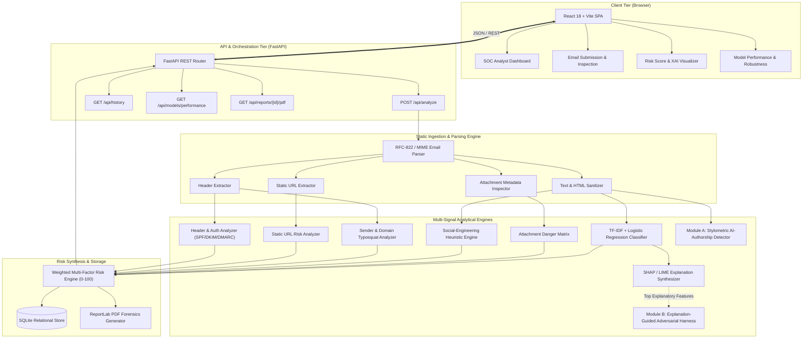

# System Architecture & Technical Design

**System Title:** AI-Based Phishing Email Detection and Explainable Risk Analysis System  
**Design Paradigm:** Local-First, Defensive-Only, Explainable, Multi-Signal Security Assessment  
**Author:** Final-Year B.Sc. Computer Science Capstone Team  

---

## 1. Architectural Philosophy & Safety Constraints

The architecture is built from the ground up as a **purely static, defensive cybersecurity analysis system**. Real-world security operations centers (SOCs) require rapid, deterministic triage of suspicious communications without introducing side-channel exposure or initiating outbound network interaction that could notify adversaries.

### Non-Negotiable Safety Invariants:
1. **Zero Outbound URL Fetching:** Parsed URLs are analyzed solely as character sequences through lexical decomposition, entropy calculation, keyword tokenization, and TLD classification. Under no circumstances does the system execute HTTP requests, DNS resolutions, or SSL handshakes against analyzed targets.
2. **Zero Attachment Execution:** File attachments are treated strictly as passive binary blobs. Analysis is confined to header metadata, filename parsing, double-extension detection, MIME-type consistency checks, and cryptographic SHA-256 digest computation. No macros, binaries, or script interpreters are invoked.
3. **Zero Third-Party Cloud Leaks:** All models, rules, database storage, and explainability algorithms execute locally on the analyst's machine. Zero email contents, headers, or hashes leave the localhost boundary.

---

## 2. High-Level System Architecture Diagram

---

## 3. Analytical Pipeline Breakdown

### 3.1 Static Ingestion & Parsing (`backend/app/utils/email_parser.py`)
- Ingests raw `.eml` files, `.txt` dumps, or pasted strings.
- Employs Python's standard `email` library with policy-aware MIME tree walking.
- Normalizes headers: `From`, `To`, `Subject`, `Date`, `Return-Path`, `Reply-To`, `Message-ID`, `Authentication-Results`, `Received`.
- Separates plain text and HTML payloads; uses `BeautifulSoup` with `html.parser` to extract clean textual content and extract `href` links without executing embedded JavaScript or external image trackers.

### 3.2 Header & Authentication Analysis (`backend/app/analyzers/header_analyzer.py`)
- Evaluates sender authentication mechanisms by inspecting `Authentication-Results` and `Received-SPF`:
  - **SPF:** Evaluates pass, softfail, fail, neutral, none.
  - **DKIM:** Checks signature presence and validation status.
  - **DMARC:** Checks policy adherence (pass, fail, quarantine, reject).
- Compares domain identities across the `From` header, `Return-Path`, and `Reply-To`.
- Flags display name spoofing (e.g., `"Microsoft Support <attacker@scamdomain.xyz>"`).

### 3.3 Static URL Risk Analysis (`backend/app/analyzers/url_analyzer.py`)
- Analyzes extracted links purely via syntactic tokenization using `urllib.parse` and `tldextract`:
  - IPv4/IPv6 literal hosts (e.g., `http://192.168.1.1/login`).
  - Punycode and IDN homograph markers (e.g., `xn--...`).
  - Excessive subdomain nesting ($\ge 3$).
  - Target brand names placed in subdomains (e.g., `paypal.com.account-update.xyz`).
  - High-risk / suspicious top-level domains.
  - Shannon entropy of path segments to flag hex/randomized payload markers.

### 3.4 Sender & Domain Impersonation Analyzer (`backend/app/analyzers/sender_analyzer.py`)
- Evaluates the sender's domain against a curated reference dictionary of commonly impersonated organizations (banking, cloud services, IT providers).
- Computes normalized Levenshtein edit distance to detect lookalike typosquatting domains (e.g., `paypa1.com`, `micros0ft.com`).
- Scans for mixed-script Cyrillic or Greek homoglyphs mimicking Latin characters.

### 3.5 Social-Engineering Heuristic Engine (`backend/app/analyzers/social_engineering_analyzer.py`)
- Evaluates the email body against curated regex and keyword taxonomy patterns covering:
  - **Urgency / Time Scarcity:** "24 hours", "immediate suspension", "account locked".
  - **Fear / Coercion:** "legal consequences", "warrant issued", "unauthorized access".
  - **Credential Harvesting Prompts:** "click here to verify", "reset your password now", "update payment information".
  - **Unsolicited Financial Incentives:** "unclaimed prize", "inheritance payout", "crypto transfer pending".

### 3.6 Attachment Metadata Analyzer (`backend/app/analyzers/attachment_analyzer.py`)
- Evaluates attached files without saving to disk or executing:
  - Dangerous executable extension checklist (`.exe`, `.scr`, `.bat`, `.vbs`, `.iso`, `.jar`, `.ps1`, `.cmd`).
  - Double-extension disguise patterns (`.pdf.exe`, `.invoice.docx.vbs`).
  - Macro-enabled document extensions (`.docm`, `.xlsm`, `.pptm`).
  - Discrepancy between declared MIME type and actual extension.
  - Calculation of deterministic SHA-256 hash for forensic logging.

### 3.7 Machine Learning Baseline Classifier (`backend/app/ml/`)
- Vectorization: Sublinear TF-IDF representation with unigram and bigram extraction (`ngram_range=(1,2)`), maximum features capped for deterministic laptop inference.
- Classification Model: Calibrated Logistic Regression model with L2 regularization.
- Outputs calibrated posterior probability $P(\text{Phishing} \mid \text{Text})$.

### 3.8 Explainable AI (XAI) Engine (`backend/app/explainability/`)
- Utilizes SHAP (`LinearExplainer`) to compute exact Shapley value attributions for individual n-grams.
- Cross-verified with LIME (`LimeTextExplainer`) for local surrogate fidelity.
- Synthesizes attributions into a concise, natural language explanation for human analysts:
  > *"The message exhibits high phishing risk primarily driven by urgency triggers ('immediate suspension') combined with credential-harvesting phrases ('verify password') and an unauthenticated sender domain."*

---

## 4. Key Novel Modules

### 4.1 Module A: AI-Generated / LLM-Authored Phishing Indicator
- **Purpose:** Determine if phishing content was generated by an LLM versus written by a human.
- **Stylometric Feature Set:**
  - Lexical diversity: Type-Token Ratio (TTR), Hapax Legomena ratio.
  - Sentence structure: Mean sentence length, variance in sentence length.
  - Syntactic markers: Punctuation density, question/exclamation density.
  - Function word distribution: Frequency of formal conjunctions and prepositions.
  - Readability metrics: Flesch Reading Ease, Flesch-Kincaid Grade Level.
- **Cross-Generator Generalization Testing:**
  - Evaluated on multiple LLM generators (e.g., Generator A, Generator B, Generator C).
  - Explicitly tests within-generator vs. cross-generator accuracy to measure and report cross-model generalization degradation.

### 4.2 Module B: Explanation-Guided Adversarial Self-Evaluation
- **Purpose:** Test whether an adversary who inspects the model's explanations (top SHAP/LIME triggers) can evade detection through paraphrasing.
- **Methodology:**
  - Identifies top predictive features for positive phishing emails.
  - Produces controlled semantic paraphrases that remove or replace those triggers while preserving phishing intent.
  - Re-evaluates both classification outcome and composite risk score.
  - Reports evasion success rates and score drops honestly as architectural limitations.

---

## 5. Risk Scoring Formula

The aggregate Risk Score ($R \in [0, 100]$) is calculated as a weighted linear combination:

$$R = \sum_{i=1}^{7} w_i \cdot S_i$$

Where weights and normalized scores ($S_i \in [0, 100]$) are:
1. $w_{\text{ML}} = 0.30$ (ML Phishing Posterior Probability $\times 100$)
2. $w_{\text{URL}} = 0.20$ (Static URL Risk Score)
3. $w_{\text{Header}} = 0.15$ (Header & Authentication Failure Score)
4. $w_{\text{Sender}} = 0.10$ (Sender Domain & Typosquatting Score)
5. $w_{\text{Social}} = 0.10$ (Social-Engineering Language Score)
6. $w_{\text{Attach}} = 0.10$ (Attachment Risk Score)
7. $w_{\text{Content}} = 0.05$ (Obfuscation & Structural Anomaly Score)

$$\sum_{i=1}^{7} w_i = 1.00$$

### Categorical Thresholds:
- **$0 \le R < 25$:** LOW (Standard legitimate characteristics)
- **$25 \le R < 50$:** MODERATE (Isolated anomalies detected; review recommended)
- **$50 \le R < 75$:** HIGH (Significant malicious indicators; quarantine email)
- **$75 \le R \le 100$:** CRITICAL (Severe multi-vector phishing indicators; immediate block)

---

## 6. Persistence & Forensic Data Model

The SQLite database stores historical investigation records and experimental metrics:

- `analyses`: ID, timestamp, subject, sender, recipient, risk score, severity, ML probability, component scores, plain-language XAI summary, AI-authorship likelihood, raw email SHA-256.
- `model_metrics`: Evaluation runs, precision, recall, F1, accuracy, ROC-AUC, confusion matrix JSON.
- `adversarial_records`: Test ID, original email ID, original score, perturbed text, perturbed score, evasion status.
